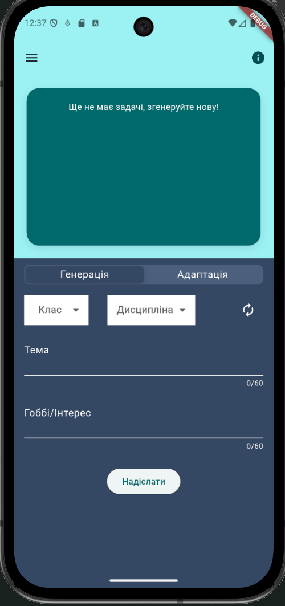
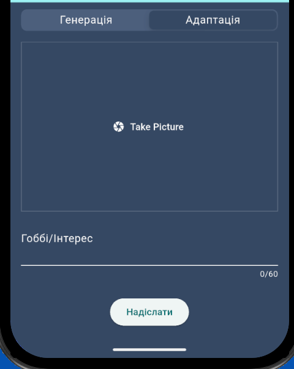
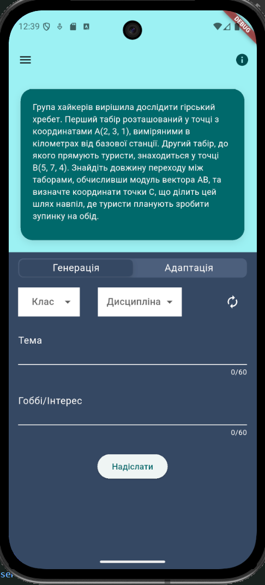
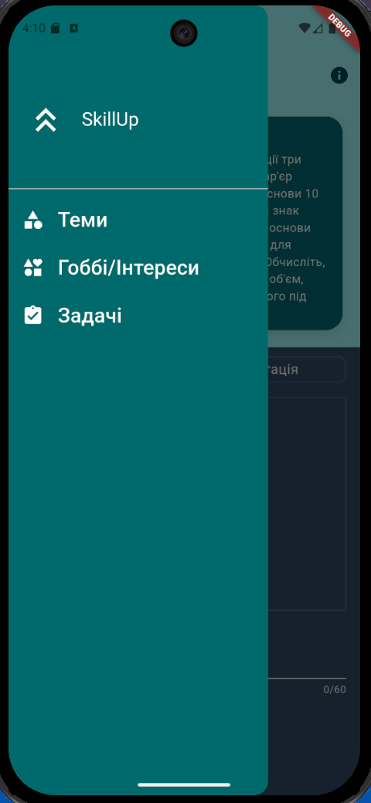
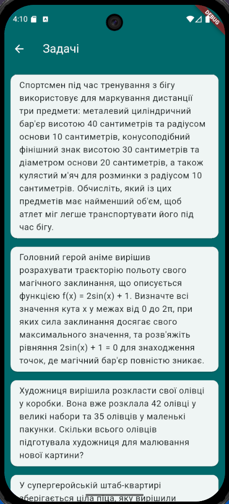

# SkillUp_app

An app that allows users to generate math problems adapted to their hobbies;

## Requirements

- Flutter (latest version)
- Android Studio (for emulator) OR real phone
- Firebase CLI

## Installation

1.  Clone repo

```
git clone https://github.com/KaterinaGrabovyk/SkillUp_app
```

2. Open project folder in console

```
cd SkillUp_app
```

3. Firebase:

   3.1 Create Firebase Console Project

   3.2 Add Firebase Logic, enable gemini Developer API

4. Install all packages

```
flutter pub get
```

5. Run configur command

```
flutterfire configure (or flutterfire.bat configure)
```

select your Firebas Console project;
select platforms;

5. Turn on Emulator or real device (make sure it`s connected)

6. run app

```
flutter run
```






